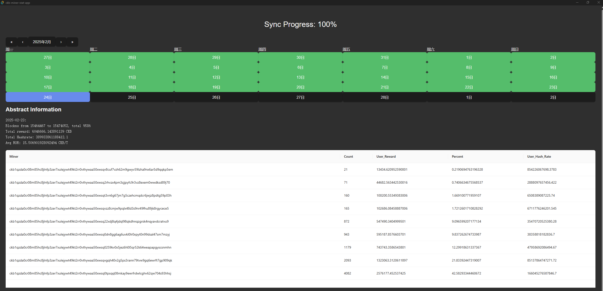

# ckb-miner-stat-app

Wrap ckb-miner-stat as windows app by Tauri.

## dev

run with debug

```
$env:RUST_LOG="debug"; npm run tauri dev
```

## release

```
npm run tauri build
```

because it's portable, so just use `src-tauri\target\release\ckb-miner-stat-app.exe`, not file in `src-tauri\target\release\bundle`.

## Usage

ckb-miner-stat-app is a portable exe file.

Download zip file from [Release page](https://github.com/fi5box/ckb-miner-stat/releases/). Then unzip it to any path you want.

While run, it will sync data from ckb netwokr. these data store in same path. if you want move, just move exe and data together.

if sync complete, date on calendar will change to green.

You can click the date on calendar, stat info about the date will show below.


